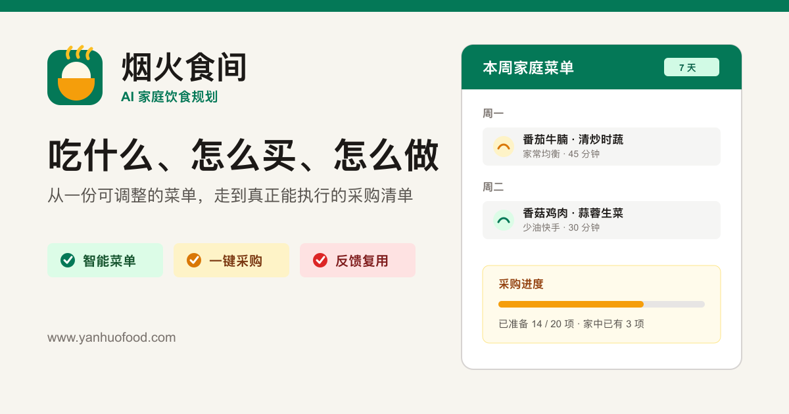
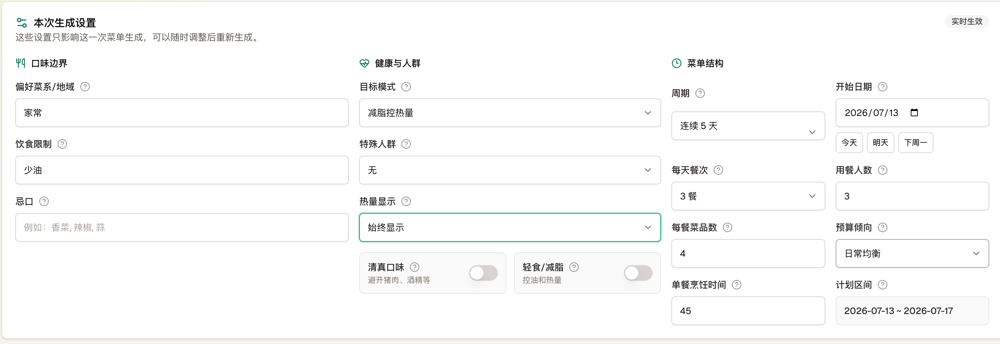
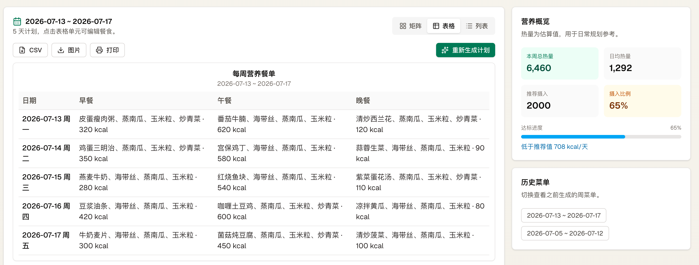

<p align="center">
  <a href="https://www.yanhuofood.com">
    
  </a>
</p>

<h1 align="center">烟火食间</h1>

<p align="center">
  一款面向真实生活的 AI 饮食规划工具。把口味、忌口、健康目标和用餐场景，变成可调整的菜单、食谱与采购清单。
</p>

<p align="center">
  <a href="https://www.yanhuofood.com"><strong>在线体验</strong></a>
  ·
  <a href="https://github.com/you-want/yanhuofood/issues/new/choose">反馈问题</a>
  ·
  <a href="./ROADMAP.md">产品路线图</a>
</p>

<p align="center">
  <a href="https://github.com/you-want/yanhuofood/stargazers"></a>
  <a href="https://github.com/you-want/yanhuofood/issues"></a>
  
</p>



> [!IMPORTANT]
> 本仓库是烟火食间的公开产品与社区仓库，用于发布产品信息、路线图、更新记录和收集反馈。应用源码目前暂未开放，本仓库不包含生产源码、模型提示词、数据库配置或部署凭据。

## 产品一览

### 先把现实条件说清楚



菜单不是凭空生成的。菜系、忌口、健康目标、人数、周期、餐次、预算和烹饪时间，都可以在生成前调整。

### 再把计划变成能执行的菜单



生成结果可以继续编辑、换菜、查看做法，并汇总成采购清单。历史菜单也会保留下来，方便复用和调整。

想了解这个产品为什么现在暂不开源、以后是否可能开源，可以阅读：[我做了一个 AI 菜单工具：先把产品做好，再考虑开源](./docs/blog/build-product-first.md)。

## 为什么做烟火食间

“今天吃什么”只是问题的开头。真正困难的是同时考虑家人的口味与忌口、营养目标、时间、预算、食材复用，以及最后能否顺利买齐和做出来。

烟火食间希望把这些零散决策连接成一条可执行的流程：

```text
饮食偏好 -> AI 菜单 -> 菜品做法 -> 食材汇总 -> 采购执行 -> 反馈复用
```

## 已有能力

| 模块 | 能力 |
| --- | --- |
| 智能菜单 | 根据菜系、忌口、健康目标、人数、餐次和场景生成菜单 |
| 食谱详情 | 展示食材、步骤、营养估算、菜品图片和制作视频搜索入口 |
| 采购清单 | 自动汇总菜单食材，支持待采购、已购买和家中已有状态 |
| 灵活调整 | 支持换菜、整餐替换、手动编辑和菜品反馈 |
| 多种场景 | 覆盖日常家庭、旅行、工作外食和集中备菜等需求 |
| 模型选择 | 支持服务端模型，以及仅保存在当前浏览器的个人模型配置 |

## 参与方式

- 觉得产品方向有价值，可以给仓库一个 Star。
- 遇到问题，请使用[问题反馈模板](https://github.com/you-want/yanhuofood/issues/new/choose)。
- 有新的生活场景或功能想法，可以提交 Feature Request。
- 想了解近期安排，请查看[产品路线图](./ROADMAP.md)和[更新记录](./CHANGELOG.md)。
- 想了解产品背后的想法，可以阅读[开发者博客](./docs/blog/build-product-first.md)。

本仓库当前不接收应用源码 Pull Request。文档修正、反馈整理和可复现的问题描述仍然非常欢迎，具体请阅读[参与指南](./CONTRIBUTING.md)。

## 关于源码

烟火食间目前仍处于快速迭代阶段，核心应用源码暂时保持私有。我们会持续评估开放部分基础模块、数据格式或工具组件的可行性，但当前没有承诺完整开源的时间表。

公开仓库的目标是保持产品进展透明，同时为用户提供稳定、可追踪的反馈渠道。

## 数据与安全

浏览器模型配置仅保存在当前浏览器中，不会提交到本仓库。请不要在 Issue、截图或日志中发布 API Key、访问令牌、个人健康信息或其他敏感数据。更多说明见[安全政策](./SECURITY.md)和[常见问题](./docs/faq.md)。

## English

Yanhuo Food is an AI-assisted meal planning product that turns dietary preferences, health goals, and real-life constraints into adjustable menus, recipes, and shopping lists.

This is the public product and community repository. The application source code is currently closed.

## Copyright

Copyright (c) 2026 烟火食间. All rights reserved. See [LICENSE](./LICENSE).
